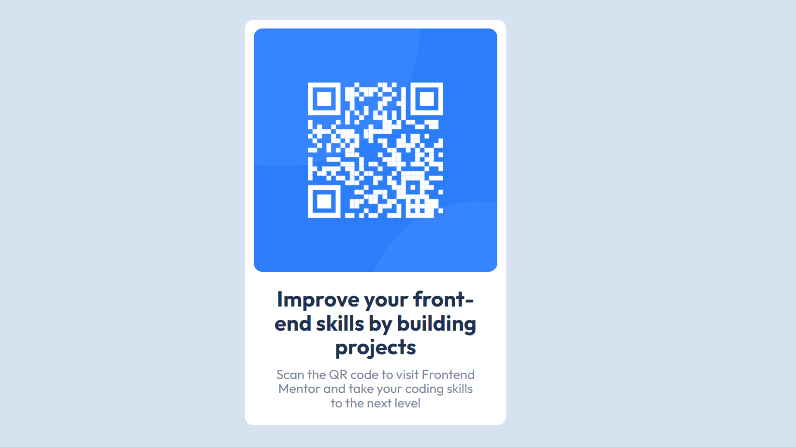

# Frontend Mentor - QR code component solution

This is a solution to the [QR code component challenge on Frontend Mentor](https://www.frontendmentor.io/challenges/qr-code-component-iux_sIO_H). Frontend Mentor challenges help you improve your coding skills by building realistic projects. 

## Table of contents

- [Overview](#overview)
  - [Screenshot](#screenshot)
  - [Links](#links)
- [My process](#my-process)
  - [Built with](#built-with)
  - [What I learned](#what-i-learned)
  - [Continued development](#continued-development)
  - [Useful resources](#useful-resources)
- [Author](#author)
- [Acknowledgments](#acknowledgments)

**Note: Delete this note and update the table of contents based on what sections you keep.**

## Overview

### Screenshot

- Solution URL: [My Solution](https://github.com/shashikantdev3/FrontendMentor-qr-code-component-main)
- Live Site URL: [Live Preview](https://shashikantdev3.github.io/FrontendMentor-qr-code-component-main/)

## My process

### Built with

- Semantic HTML5 markup
- CSS custom properties
- Flexbox
- CSS Grid

### What I learned

This is my third Challenge though I should take it as my First Challenge as this is very simple but very good practice for those who just learned HTML CSS concepts like accesibility, Grid, Flex, Media Query. I have already learned these concepts in my past two Challenges which are [First Challenge](https://www.frontendmentor.io/solutions/responsive-product-preview-card-component-using-css-grid-and-flexbox-gZz2gLwuMi), [Second Challenge](https://www.frontendmentor.io/solutions/results-summary-component-main-using-css-grid-and-flex-dW-BwF65IV)

## Author

- Website - [Shashikant](https://www.your-site.com)
- Frontend Mentor - [@shashikantdev3](https://www.frontendmentor.io/profile/shashikantdev3)
- Twitter - [@shashikantdev3](https://www.twitter.com/shashikantdev3)
